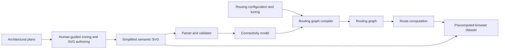
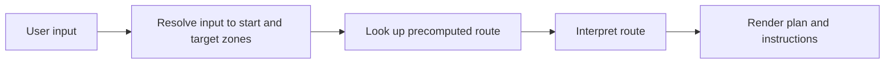
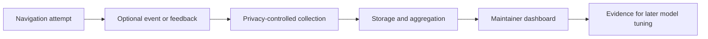

# ai agents responses

## copilot chat agent

### Response 1

Your three-way distinction is sound. I’ll map the canonical documents and archived ideation onto development, build, and operation, then identify the interfaces between them so future ideas can be assigned without mixing lifecycle stages.

The central correction is already clear: route *search* belongs to the offline build in the current architecture, while browser “search” means resolving a user’s text to a zone and looking up a precomputed route. I’m consolidating the artifacts and future ideas around that boundary now.

Yes, this is a substantially clearer and more accurate understanding. The main improvement is separating three different kinds of process that the existing diagram conflates.

#### 1. Development lifecycle

This is how the system is created and changed:

```text
requirements and model
    ↓
system design and contracts
    ↓
implementation by component
    ↓
tests and validation
    ↓
integration
    ↓
release and maintenance
```

Development produces:

- authoring procedures and SVG tooling
- graph compiler
- route-computation program
- browser client
- fixtures and tests
- configuration formats
- documentation

This is not a data pipeline in quite the same sense as build and operation. It is better described as a lifecycle containing several parallel workstreams.

#### 2. Offline build pipeline

Your outline is correct, with one qualification: architectural plans are initially evidence for human-guided SVG authoring, not necessarily machine-readable program input.



The important artifacts are:

1. Semantic simplified plan
2. Parsed and validated connectivity model
3. Routing graph
4. Precomputed route dataset
5. Browser-ready plan and location catalog

The adjacency graph belongs upstream of zoning in the theoretical model, but its automated production is currently deferred. It should remain visible as an optional or future build stage rather than becoming a blocker.

Routing configuration enters at routing-graph construction, not SVG authoring. It contains decisions such as costs and variants, while the SVG remains authoritative for spatial geometry.

#### 3. Runtime operation

Your simplified operational process is accurate:



The terminology matters here:

- Input search means finding and resolving room numbers, names, or aliases.
- Route search means Dijkstra or another graph algorithm executed during the offline build.
- Runtime route lookup means selecting an already computed result.

Calling all three “search” would obscure the architecture.

The operation also has supporting behavior:

- loading the dataset
- input validation and disambiguation
- variant selection
- same-zone and unreachable handling
- error presentation
- static-navigation disclosure

These are operational concerns, but not additional routing stages.

#### 4. Analytics is a separate operational pipeline

Analytics should not be inserted into the main route flow:



It observes selected events from operation and may eventually inform later development or routing configuration. It must not become a prerequisite for route lookup or display.

#### Where ideas belong

| Idea | Primary compartment |
| --- | --- |
| SVG authoring procedure | Build |
| SVG parser and validator | Build |
| Graph compiler | Build |
| Costs and routing variants | Build configuration |
| Dijkstra route computation | Build |
| Room-number and alias resolution | Operation: input |
| Precomputed route selection | Operation: lookup |
| Map and instructions | Operation: output |
| UI controls and layout | Operation |
| UX rules and error behavior | Operation, cross-cutting |
| Tests and fixtures | Development, cross-cutting |
| Analytics and feedback | Separate operational write pipeline |
| Dashboard | Analytics operation |
| Full-building and multi-floor support | Future development expanding build artifacts |
| Automatic adjacency extraction | Future upstream build tooling |

One adjustment to the earlier level plan follows from this model: Levels 1–4 are not themselves the permanent pipeline. They are a development strategy for constructing and validating portions of the build and operational pipelines incrementally. The fictional graph is a development fixture that substitutes for one build artifact. It is not an alternative build process.

I would therefore organize the project’s big picture as four diagrams or sections:

1. System model: zones, portals, segments, states, routes.
2. Development lifecycle: how components are built and integrated.
3. Offline build pipeline: how source material becomes deployable data.
4. Runtime operation: how user input becomes displayed guidance.
5. Separate analytics loop, once its design becomes active.

The archived pipeline diagram remains useful for explaining derivation and interpretation, but it should not serve as the master lifecycle diagram. It combines model transformation, build execution, and runtime interpretation, and its old `rulebook_sorted.md §3.6` reference confirms that it represents an earlier conceptual stage.

### Response 2

It is **three processes plus one model**, not four pipelines. The system model describes what the objects *are and how they relate*; the other three describe what happens over time.

For terminology, I’d consistently use **input resolution**, **offline route computation**, and **runtime route lookup**. Put that three-line distinction near the top of `pipelines.md`, where a reader encounters it before any diagram. “Offline build pipeline” is a kind of data-processing pipeline, but “build pipeline” better captures its human SVG-authoring and validation steps.

Here is how I’d depict the four views:

1. **System model: a relationship diagram, not a pipeline.** Show zones joined by portals; segments connect portal pairs *within* a zone; directed states cross portals; a route alternates zones and portals. Keep the definitions authoritative in the rulebook, with only a compact overview here.
2. **Development: a dependency map.** Show the graph contract feeding two parallel workstreams: a fixture-backed route solver and browser client on one side, SVG authoring and graph compilation on the other. They meet at a contract test and human verification gate. This explains *why development need not follow build order*.
3. **Build: an artifact-flow diagram.** Architectural evidence → human-guided semantic SVG → parsing and validation → connectivity model → routing graph (also receives costs and variants) → offline route computation → deployable browser data. The displayed SVG travels alongside that data.
4. **Operation: a short interaction flow.** Typed room/name → resolve to one zone per input → look up a precomputed route → render plan and directions, including errors and unreachable results. No graph algorithm runs here.

Yes, a persistent document is a good idea. I’d make `pipelines.md` a concise working overview with those four views, explicit artifact boundaries, and links to canonical definitions, rather than a second rulebook. One placement concern: `archive` suggests retired material and is ignored by Git. For an active draft that stays local, `docs/ignore/pipelines.md` is clearer; for a document collaborators should receive, `docs/pipelines.md` is the better eventual home. A diagram-only file is an alternative, but Markdown better supports the terminology clarification and decisions still in progress.

I’ll leave analytics entirely outside these views and this discussion, as requested.

### Response 3

I’ll read the new design drafts alongside the current rulebook and system-design document, then suggest a structure that gives each file a clear role without making the overview a second source of truth.

The folder is a good home for this work. I checked it: the four individual documents are currently headings or empty, while `pipelines.md` is still the conversation pasted in full. That is a useful scratch state, but I would now give the files distinct jobs.

| Document | Job |
| --- | --- |
| `system-model.md` | Visual explanation of the rulebook’s concepts and relationships; no new definitions |
| `development-lifecycle.md` | How we implement, test, integrate, and release the components |
| `build-pipeline.md` | Authored inputs, transformations, validation, and generated artifacts |
| `operation-flow.md` | Input resolution, precomputed route lookup, and displayed guidance |
| Overview, currently `pipelines.md` | A short map linking the four views and defining their boundaries |

I would call the overview `system-overview.md`, not `big-picture.md`: it says what a new reader will find there, while avoiding the suggestion that the *system model* itself is a pipeline. Keep it short, perhaps one diagram showing how build output supplies operation, plus links to the four detailed views. Remove the chat transcript and analytics material from the active overview when drafting it.

`system-design.md` has a different role: it records *decisions* the rulebook leaves open, such as where costs are assigned. Moving it into `design` makes sense once that distinction is written down, but I would **not absorb the overview into it**. Otherwise a reader has to distinguish orientation, current decisions, and proposed future stages inside one document. Its current modeling-pipeline section also presents adjacency-graph production as part of the system; the new build view should distinguish the intended model from what is actually implemented or deferred.

My suggested boundary is: **rulebook = normative model; system overview = orientation; four views = explanations of processes and relationships; system design = binding implementation decisions; implementation plan = work not yet done.** That lets the folder grow without creating competing sources of truth. No files changed.

### Response 4

I’ll check the five drafts and any repository instructions, then add a deliberately small first version: one overview and four focused views. I’ll leave `system-design.md` where it is and unchanged.

The five drafts are empty or header-only, and `design` is untracked on `local/simpler`. I’ll add compact diagrams and boundary notes, labeling the flow as the intended design so it does not imply the prototype already builds from the SVG.

I populated the five files with a minimal starting structure: `system-overview.md` links the views and distinguishes input resolution, offline route computation, and runtime lookup; the other four each have a short diagram and boundary note.

I left `system-design.md` unchanged. Markdown diagnostics pass for all five drafts.

### Response 5

### Response 6

### Response 7
