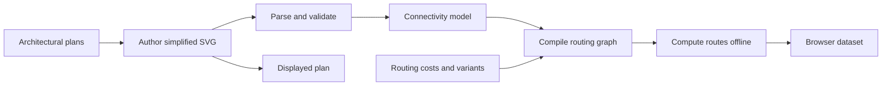

# Build pipeline

This is the intended offline flow, not a claim that every stage is implemented today. Architectural plans guide human authoring rather than being automatically parsed.

The graph and browser dataset must agree on zone and portal identifiers; the displayed plan and route geometry must share coordinates. The adjacency graph is part of the [rulebook](../rulebook.md) model, but automated production of it is a future direction in the [implementation plan](../implementation-plan.md).
