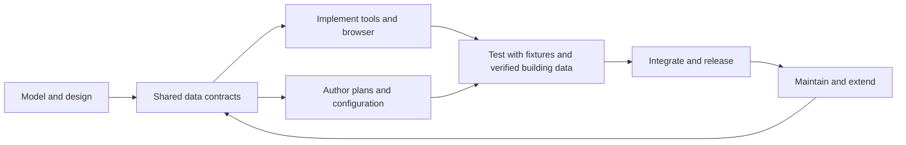

# Development lifecycle

Development creates the tools, assets, and client. Its order need not match the order in which a finished system builds data.

Controlled fixtures test changes before and after real plans are available, including when adding buildings or maintaining the program. Verified building data is needed before offering building guidance; fictional fixtures remain test data, not public navigation data.
