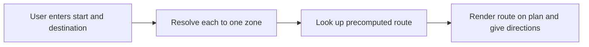

# Operation flow

The browser uses an already built dataset and plan. Route lookup is not graph search.

Input resolution may require correction or disambiguation. Lookup may return an unreachable result. The guidance is static: the browser does not know or track the user's current position.
