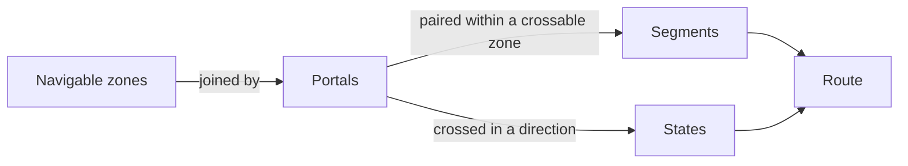

# System model

This is a relationship view, not a sequence of processing steps. The [rulebook](../rulebook.md) defines these terms and their constraints.

A route alternates zones and portals. Its directed states describe crossings; its segments describe travel between successive portals within a zone. The search finds a lowest-cost route between navigable start and target zones.
