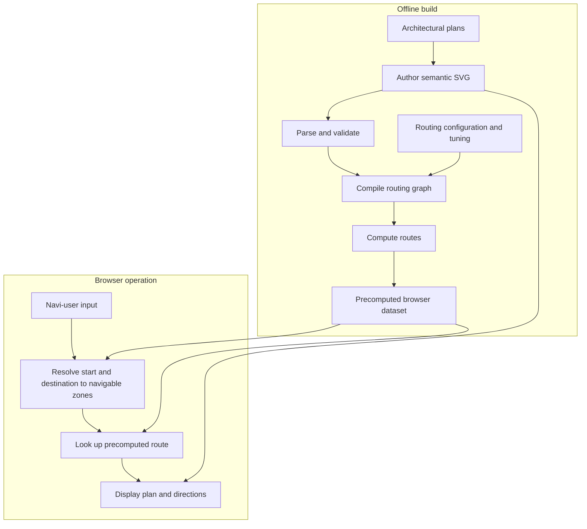

# System overview

The [rulebook](../rulebook.md) defines the navigation model; [system design](../system-design.md) records implementation decisions. The views below explain how the intended system is developed, built, and used. They do not replace either source.

Development creates and verifies the tools and client that carry out these flows. The architectural plans guide human authoring; the diagram does not imply automatic plan extraction. The semantic SVG is both an authored build input and the displayed plan.

| View | Question |
| --- | --- |
| [System model](system-model.md) | What are zones, portals, segments, states, and routes? |
| [Development lifecycle](development-lifecycle.md) | How are the program and its assets made and verified? |
| [Build pipeline](build-pipeline.md) | How do authored plans become deployable route data? |
| [Operation flow](operation-flow.md) | How does a request become displayed guidance? |

Use distinct terms: input resolution finds a navigable zone from a navi-user's entry; offline route computation searches the graph; runtime route lookup selects a precomputed result.
