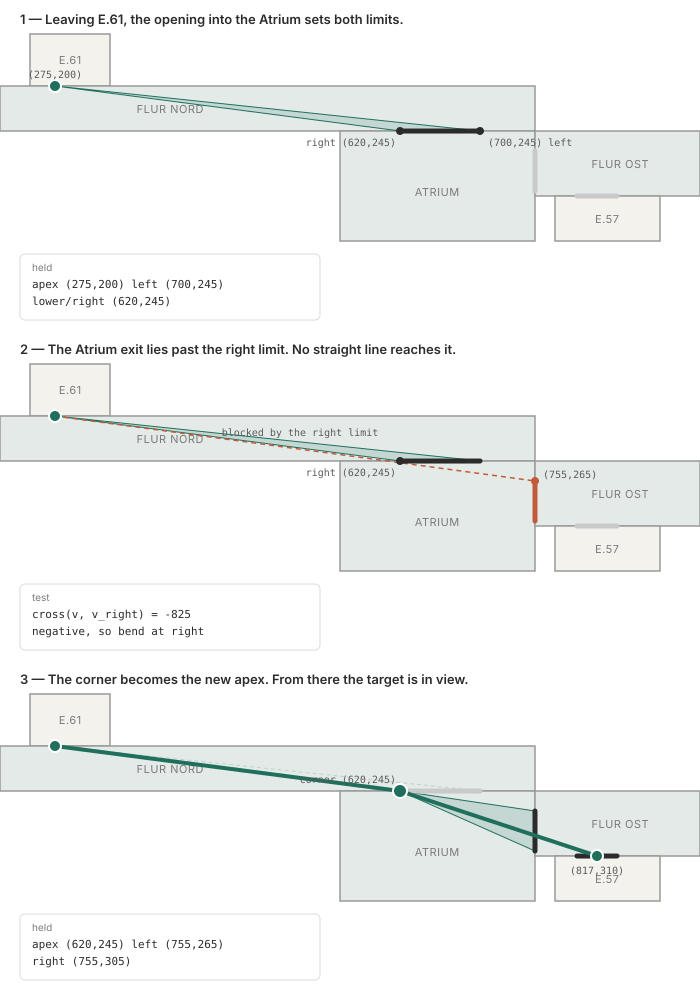

# The funnel algorithm

Given a chain of portals separating convex cells, the funnel algorithm produces the shortest line that passes through all of them. Lee and Preparata, 1984; the "Simple Stupid Funnel Algorithm" is a readable modern write-up.

## The taut path

Thread a string from the start, through each portal in turn, to the target, then pull both ends tight. The string runs straight wherever nothing is in the way, and where it cannot run straight it presses against the edge of an opening and changes direction there. That shape is the taut path: the shortest line that still passes through every portal in the sequence.

## What is held

Three values:

| | |
| --- | --- |
| apex | the point directions are currently measured from |
| left | the point whose direction is the current left limit |
| right | the point whose direction is the current right limit |

Left and right are points, not angles. What gets compared is the direction from the apex to each of them, and the pair of directions bounds a wedge. Any direction inside the wedge reaches every portal seen so far in a straight line.

## The comparison

For two vectors from the apex, `v` and `w`:

```text
cross(v, w) = v.x * w.y − v.y * w.x
```

One number, and its sign says which side of `v` the direction `w` lies on. Zero means they point the same way.

Establish the convention once from the first portal, then it holds throughout: if `cross(v_left, v_right)` is positive, a direction `v` is inside the wedge when `cross(v_left, v) > 0` and `cross(v, v_right) > 0`.

Two multiply-subtracts per test, four tests per portal.

`dy/dx` is undefined when `dx` is zero, and a portal edge directly above the apex is ordinary rather than exceptional. Slope also gives the same value for a direction and its opposite, so a point behind the apex would test as if it were ahead. The cross product has neither problem.

## Worked example

The route from E.61 to E.57 through the east wing: Flur Nord, the Atrium, Flur Ost. Coordinates from the schematic plan.



Apex is the E.61 door at `(275,200)`. The opening from Flur Nord into the Atrium spans `(620,245)` to `(700,245)`.

```text
v_left  = (700,245) − (275,200) = (425, 45)
v_right = (620,245) − (275,200) = (345, 45)
cross(v_left, v_right) = 425·45 − 45·345 = 3600
```

Positive, so the convention is fixed: left then right is positive.

The Atrium exit into Flur Ost spans `(755,265)` to `(755,305)`. Test its left edge:

```text
v = (755,265) − (275,200) = (480, 65)

cross(v_left, v) = 425·65 − 45·480 = 6025    positive, inside the left limit
cross(v, v_right) = 480·45 − 65·345 = −825   negative, past the right limit
```

The second test fails. No straight line from `(275,200)` passes through both openings, which the geometry confirms: that line crosses `y = 245` at `x = 607`, and the opening only begins at `620`.

So the path bends, at whatever `right` holds — `(620,245)`. Nothing is searched for; the variable already holds it, because each tighter constraint overwrote it as it appeared.

The corner becomes the new apex. Left and right are reset from the Atrium exit's edges, and the E.57 door at `(797,310)`–`(837,310)` tests inside both. The taut path is:

```text
(275,200) → (620,245) → (817,310)
```

Two straight runs, one corner.
