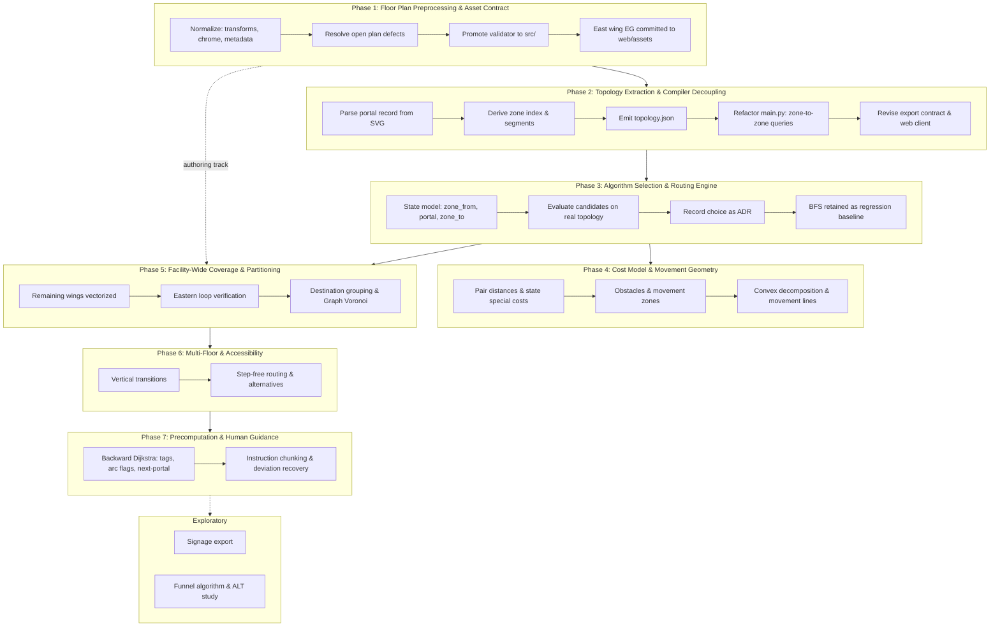

# Roadmap

State: 2026-09-11

## Execution & Tracking

To coordinate implementation between contributors without documentation drift or Git conflicts:

- **Macro View (GitHub Milestones)**: Each major phase corresponds 1:1 to a container GitHub Milestone, tracked as high-level checkboxes in [README.md](../README.md).
- **Micro View (GitHub Issues)**: Specific technical bullet points under each phase serve directly as actionable GitHub Issues assigned to individual contributors.

Detail decreases with distance. Near phases are specified to the level of actionable issues; far phases only to the level of intent. Later phases are deliberately underspecified — their requirements are expected to be revealed by the phases preceding them.

## Conceptual Basis

The conceptual model is fixed by `axioms.md` (19 axioms). The earlier `wegweiser-design.md` is superseded and must not be cited. This roadmap implements those axioms; it does not restate or renegotiate them.

Three consequences shape the sequence:

- **The portal record is the only authored primitive.** The zone index and the segment list are derived by inversion (axioms 5–6), never written by hand.
- **Geometry is legitimate at exactly one place.** Distance belongs to the unordered portal pair within a zone (axiom 10). It is never used as a heuristic between arbitrary points — which is why A\* was rejected.
- **The floor plan SVG is the source of truth.** Geometry and topology are authored once per floor and parsed into the compiler (`zoning_guidelines.md`).

## Overview

The facility is a star topology radiating from central junctions, with cycles concentrated in the eastern block. Full build-out is ~200–300 zones, so runtime latency is negligible (<1 ms) for every candidate algorithm. Performance is therefore not a selection criterion. What discriminates: correctness under loops, instruction quality, deviation robustness, and authoring cost.

Route choice is rare in this building — most of the graph has exactly one sensible path. The real difficulty is not pathfinding but turning a zone sequence into usable German instructions.

**Parallel authoring track.** Vectorizing the remaining wings begins in Phase 1 and runs continuously alongside Phases 2–4. Code work proceeds against the finished east wing; the complete-building topology is derived once the refactor is proven. Phase 5 is numbered where its *completion* gates partitioning, not where its work starts.

## Phases

### Phase 1: Floor Plan Preprocessing & Asset Contract

Produce a verified, machine-readable floor plan. Current phase, and the prerequisite for everything downstream. Method is specified in `zoning_guidelines.md`: supervised hybrid vectorization, with human verification as the quality gate.

**Source hierarchy.** `Flucht- und Rettungsplan B 7967_059 (2026)` supersedes `Lageplan EG v1.2 (2018)` wherever they disagree — room numbering has drifted and the personal names on the 2018 plan are eight years stale. The Lageplan remains authoritative for wing layout and overall geometry. The Rettungswege drawn on those plans are professionally-drawn movement lines and are the reference for Phase 4.

**Asset normalization:**

- Bake `transform="translate(...)"` offsets into absolute coordinates on `#zones`, `#portals` and `#obstacles`. The prototype carries `translate(60 110)` on every routing group — presentation padding leaking into coordinate space.
- Separate chrome (`#labels`, `#decor`, `#legend`) from geometry (`#shell`, `#zones`, `#portals`, `#obstacles`). Chrome is CSS-hidden or stripped in the kiosk build.
- Strip C2PA and editor metadata blobs (~20 KB base64 in the prototype) before an asset enters [web/assets](../web/assets).
- Fix a canonical `viewBox` per floor so layers stack without rescaling.

**Markup contract** (detailed in `zoning_guidelines.md`, Authoring Contract):

- `<g id="zones">` — `rect` / `polygon` / `path` with `id`, `data-kind`, `data-label`.
- `<g id="portals">` — `circle` with `id`, `data-a`, `data-b`.
- `<g id="obstacles">` — shapes with `data-zone`. Booths, counters, seating and atrium voids are obstacles, never zones.
- Naming per `zoning_guidelines.md`: zone ids are printed room numbers (`E.54a`, `R.58`) or lowercase slugs (`flur_nord`, `atrium`); exterior is `aussen`; portal ids are sequential (`p01`); labels are German as printed.

**Validator adoption:**

- Promote `validate_plan.py` from `docs/ignore/files_260911/` into [src](../src). It already checks axioms 1, 2, 3, 4 and 16, portal-on-boundary geometry, shared-wall existence, graph reachability, duplicate portals and single-portal stairwells, using the standard library only.
- Wire it into the test suite so a contract violation fails the build.

**Open plan defects to resolve:**

- `E.56c` is non-convex (area/hull = 0.855) — split it, per axiom 4.
- `TR9` has a single portal, implausible for a Treppenhaus on an escape plan.
- `E.52` / `Wachdienst` overlap, pending conversion of `Wachdienst` to an obstacle.

**Deliverable:** verified EG east wing SVG committed to [web/assets](../web/assets), replacing `Grundriss_mit_Knotenpunkten.png`.

### Phase 2: Topology Extraction & Compiler Decoupling

Separate building data from routing logic. [src/main.py](../src/main.py) currently hardcodes `nodes`, `checkpoints` and `connections`; these become parsed input.

- **Parse the portal record** from `#zones` / `#portals` / `#obstacles` using the standard library only, per the no-dependency rule in [README.md](../README.md).
- **Derive, never author**: zone index by inverting the portal record (axiom 5); segment list as all portal pairs within a zone (axiom 6).
- **Emit `topology.json`**: zones (`id`, `kind`, `label`, geometry), portals (`id`, coordinates, zone pair), obstacles, floor metadata.
- **Terminology**: rename `connections` to `edges`, per the node/edge note in `research_notes.md`.
- **Fix the premise gap.** The current code cannot express "where I am" or "where I want to go": checkpoints are corridor positions rather than rooms, and the start is hardcoded to the Haupteingang. Queries become zone → zone (axiom 11); start states are the start zone's outbound states, target states its inbound states (axiom 12). `start_point` is currently orphaned from the `"startpunkt"` label after the German→English rename — remove it with the hardcoded data.
- **Revise the export contract.** This is a breaking change, not a stable one: `destinations` becomes zone ids, and a route becomes the canonical alternating sequence `zone₁ portal₁ zone₂ … portalₙ zoneₙ₊₁` (axiom 14). Include the axiom-14 validity check — for every `zoneA portal zoneB` triple, that portal's two zones must be exactly `{zoneA, zoneB}`.
- **Update the web client**: [web/script.js](../web/script.js) resolves portal coordinates from the sequence for the `<polyline>`; [web/index.html](../web/index.html) inlines the floor SVG so the overlay shares its `viewBox`; zone ids and `data-kind` become CSS hooks for destination highlighting.
- **Tests**: parser unit tests, validator rejection cases, a fixture SVG, and contract assertions in [src/test_main.py](../src/test_main.py).
- **Review the checks as one suite.** With the validator promoted and the export contract rewritten, both boundary checks exist in their final form for the first time. Audit them together against the criteria in `working_notes.md`: every rulebook constraint checked exactly once, nothing duplicated, nothing contradictory, each check owned by a clear boundary. Files in sensible places, named consistently, one command running everything.

### Phase 3: Algorithm Selection & Routing Engine

The choice is narrowed, not settled. It is made here, against the real topology produced by Phase 2 — because the current dataset cannot discriminate between candidates.

- **Implement the state model**: `zone_from | portal | zone_to`, two states per portal, direction carried by the order (axiom 7). Search space is 2 × portal count. Successors are every other portal of the zone just entered (axiom 9).
- **Route cases** per axiom 15: same zone (one access segment); adjacent zones (two access segments); otherwise two access segments plus *n* transit segments. A reduction of the general case, not a special-cased collapse.
- **Prerequisite for a meaningful comparison**: the dataset must contain at least one cycle. The 2026-09-10 graph was a tree (13 labels, 12 edges), on which every candidate returns identical output. Verify whether the east wing as drawn contains a cycle; if not, the eastern loop must land from the Phase 5 track before selection is decidable.
- **Leading candidate**: Dijkstra over states — always correct, handles the cost model, and serves as ground truth for whatever is layered above it.
- **Already rejected for this building** (do not re-litigate): A\* (a straight-line heuristic is actively misleading in a star topology), D\* Lite (recomputing is cheaper than repairing at this scale), contraction hierarchies and hub labelling (continental-scale machinery).
- **Retain BFS** as the original implementation and an algorithmic regression baseline.
- **Record the decision** and its rejected alternatives in [docs/adr.md](adr.md).

### Phase 4: Cost Model & Movement Geometry

Make routes match how people actually walk. Concrete values are provisional and expected to be revealed by Phases 2–3.

- **Two cost surfaces, per axiom 10**: distance on the unordered portal pair within a zone, measured from the Grundriss; special costs assigned by the designer to individual states. Turn costs need no special machinery — arrival direction is already expressible in the state.
- **Scale calibration**: pixel-to-meter factor so geometric distance and discrete penalties are commensurable.
- **Movement zones** (axiom 16): the walkable part of a zone, obstacles excluded, lying wholly within one zone. Circulation space spanning a boundary is two movement zones meeting at the portal, never one crossing it.
- **Movement lines** (axiom 17): derived by convex decomposition; resulting virtual portals are the polyline vertices. Hand-adjustable where real behaviour departs from geometric optima. The Rettungswege on the source plans are the reference.
- **Access vs. transit segments** (axiom 18): access segments are direct lines and do not follow the movement line; transit segments do, with foot points and stubs for off-line portals.
- **Read before hand-drawing**: the funnel algorithm may compute a usable default line, to be overridden only where behaviour departs from taut-string geometry (`research_notes.md`, reading priority).

### Phase 5: Facility-Wide Coverage & Destination Partitioning

Scale from the east wing to the complete facility (~200–300 zones). Authoring runs in parallel from Phase 1; this phase is where it completes and is exploited.

- Vectorize the remaining wings (North, North-West, West, South) and the looped eastern block under the Phase 1 contract, one SVG per floor.
- Verify the eastern loop resolves to optimal paths without unnatural detours — the highest-value data change, since it is what makes algorithm behaviour observable at all.
- Derive the complete-building topology once the Phase 2 refactor is proven.
- Duplicate portals between the same zone pair are kept separate only when the choice between them changes a route; adjacent doors merge into one.
- Destination grouping: cluster destinations by wing or department (Graph Voronoi cells, where portals claim surrounding territory) to keep suggestion lists manageable.

### Phase 6: Multi-Floor Movement & Accessibility

- Floor metadata on zones; stairwells and lifts as discrete transfer costs rather than geometric distances, using the per-floor Rettungsplan boards.
- Step-free routing by filtering `data-kind="stairs"` — no separate graph.
- Alternative routes via Yen's k-shortest paths for accessibility variants and second-choice offers.
- Multi-floor SVG layer switching in [web](../web).

### Phase 7: Precomputation & Human Guidance

- One backward Dijkstra pass yields three products: tags (Graph Voronoi), arc flags (direction pruning), and next-portal tables. Not three techniques — three things kept from one computation.
- Tags are directional: they attach to a portal approached from a given side, matching how real single-sided signage works.
- Routes as a replay of stateless decisions rather than stored path strings, so a printed route and a live "where do I go now" answer cannot disagree.
- Deviation recovery by portal-name localisation — the user reports a named landmark and the loop re-runs from there.
- Instruction chunking into memorable German steps at portal boundaries.

### Exploratory Horizons

- Directional arc flags driving a physical signage schedule export.
- Dynamic cost adjustment for facility events (lift outage, wing closure); treat the precomputed table as a disposable cache and rebuild rather than patch.
- Funnel algorithm, ALT landmark heuristics and HPA\* as study material on a working system.

## Open Questions

Each will force a decision in the phase noted.

1. **Tag granularity** (Phase 7). One entry per room is precise but produces signs listing hundreds of destinations. Grouping makes signage readable and accepts suboptimality deliberately. This tradeoff is the real design work.
2. **Portal identification by the user** (Phase 7). How someone states where they are. This is every interaction's entry point, not only a recovery path.
3. **Instruction chunking** (Phase 7). How many segments collapse into one printed instruction, and which landmarks to name.
4. **Destination vocabulary** (Phase 2). Rooms carry both stable numbers (`E.67`) and semantic names (`Tagungsraum`, `Speisesaal`). Users will mix them.
5. **Start position within a zone** (Phase 4). Axiom 11 makes the start a zone, so every start state begins at zero cost. Correct in a small room, wrong in the Speisesaal. A known and currently accepted imprecision.

