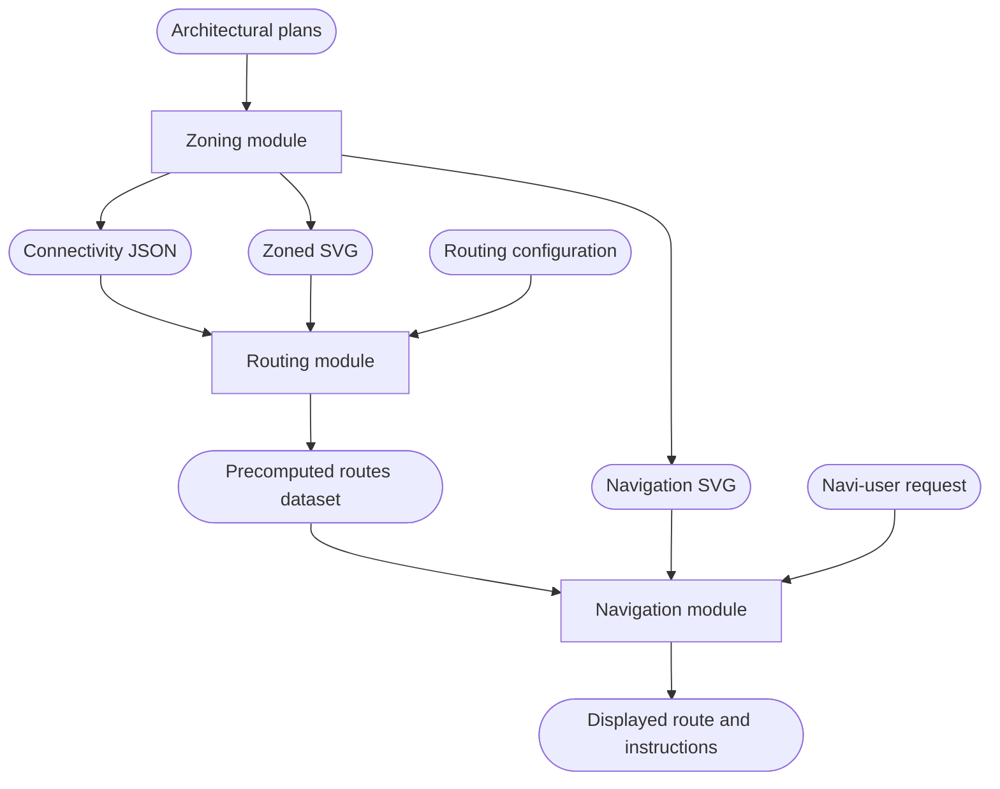
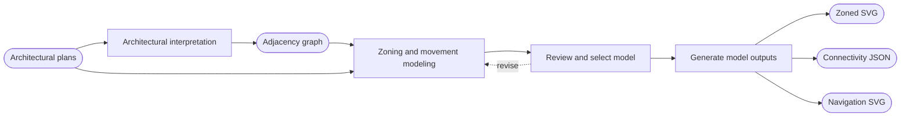
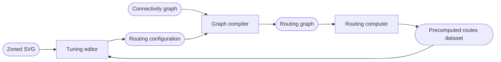
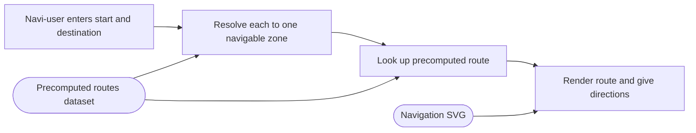

# System design

The rulebook defines the model theoretically, covering its terms and their relationships. This document specifies the current system design by making the system-level design decisions that conform strictly to the model, using tools such as clarifying and exemplifying rulebook terms and resolving what the rulebook deliberately leaves open.

## Conceptual model

[placeholder]

## System overview

Route search happens offline in the Routing module. The Navigation module selects and presents a precomputed route.

## Modeling pipeline

The system implements a human-in-the-loop, computer-assisted modeling pipeline.

1. Architectural plans are interpreted into a machine-readable adjacency graph.
2. The plans and adjacency graph are used in zoning to produce the Zoned SVG, Navigation SVG and connectivity graph.
3. The routing graph is constructed from the connectivity graph and serialized.
4. Routes are computed by searching the routing graph and serialized for the Navigation module.
5. The Navigation module renders routes on the Navigation SVG for the navi-user.

## Zoning module

The zoning editor is the interface the zoning author uses to create and edit a digital building model and generate outputs for routing and navigation.

### Working view

- Zoning working view: the model plus review layers, used by the zoning author during authoring and review.

### Outputs

- Zoned SVG (provisional name): the clean semantic floor plan, paired with connectivity JSON.
- Navigation SVG: a map generated by the zoning module for displaying routes to the navi-user.

### Requirements

- A navigable zone that provides the only access to another navigable zone must be crossable.
- The connectivity graph includes authored movement geometry, including designer-drawn movement lines.
- The Zoned SVG and connectivity JSON are generated from the same explicitly selected approved baseline revision, excluding the reference underlay and review annotations.
- The Navigation SVG and displayed route geometry must share a coordinate frame.

## Routing module

### Tuning

Tuning is the iterative adjustment of routing configuration, which holds costs and variant-specific restrictions. The tuning editor, a repurposed version of the zoning interface, shows the calculated routes of the precomputed routes dataset on the Zoned SVG.

A special cost is any factor beyond distance that makes a state or segment harder or easier for a person, for example a turn, a door, or a floor change. The graph compiler applies special costs to the states and segments of the routing graph.

## Navigation module

- Input resolution may require correction or disambiguation and excludes non-navigable zones.
- Lookup may return an unreachable result.
- The current browser implementation cannot track the navi-user's realtime position.
- The browser uses an already built dataset and plan.
