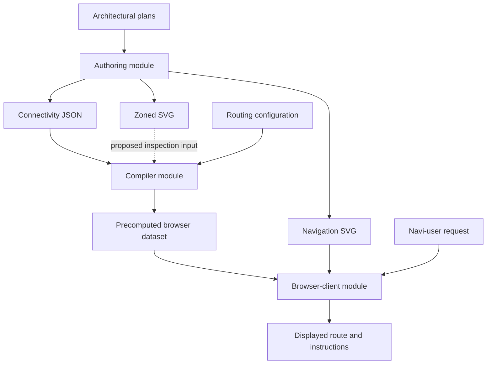
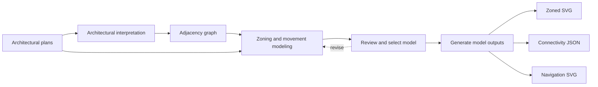
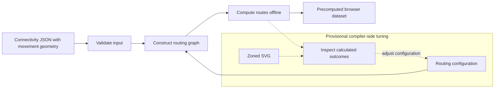
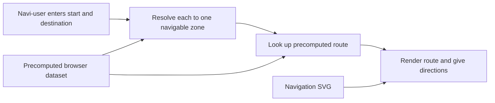

# System design

The rulebook defines the model theoretically, covering its terms and their relationships. This document specifies the current system design by making the system-level design decisions that conform strictly to the model, using tools such as clarifying and exemplifying rulebook terms and resolving what the rulebook deliberately leaves open.

## Conceptual model

[placeholder]

## System overview

Route search happens offline in the compiler. The browser client selects and presents a precomputed route rather than searching the graph.

The dashed connection represents the provisional use of Zoned SVG for tuning inspection, not a requirement to parse it for numerical route computation. Module boundaries do not prescribe programming languages or directory placement.

## Modeling pipeline

The system implements a human-in-the-loop, computer-assisted modeling pipeline with two complementary representation types:

- visual representations: architectural plans, simplified floor plans, spatial routing plans, and graph visualizations
- machine-readable symbolic representations: serialized graph models containing nodes, edges, and attributes

1. Architectural plans are interpreted into a machine-readable adjacency graph.
2. The plans and adjacency graph are used in zoning to produce zoning SVGs and a connectivity graph.
3. The routing graph is constructed from the connectivity graph and serialized.
4. Routes are computed by searching the routing graph and serialized for the browser client.
5. The browser renders routes on the navigation SVG for the navi-user.

## Authoring

### Tenets

- A navigable zone that provides the only access to another navigable zone must be crossable.

### Representations and outputs

The intended design uses one editable project to support distinct representations, not three independently edited SVG files:

- Zoning working view: the model plus review layers, used by the zoning author during authoring and review.
- Zoned SVG (provisional name): the clean semantic floor plan, paired with connectivity JSON.
- Navigation SVG: a map generated by the authoring module for displaying routes to the navi-user.

The Zoned SVG and connectivity JSON are generated from the same explicitly selected approved baseline revision, excluding the reference underlay and review annotations.

The connectivity graph includes authored movement geometry, including designer-drawn movement lines.

The navigation SVG and displayed route geometry must share a coordinate frame. These are intended representation and output responsibilities, not claims that the capabilities are already implemented.

## Compiler

The exact movement-geometry encoding and compiler input requirements remain unspecified. If connectivity JSON supplies all required geometry, numerical route computation need not parse Zoned SVG.

### Tuning

The routing/tuning editor edits routing configuration to tune calculated route outcomes. Movement geometry is editable in the zoning editor but fixed and inspectable in the routing/tuning editor.

Placing iterative tuning within the compiler module and using Zoned SVG for inspection remain a provisional design direction. A repurposed redline interface is a candidate, not a selected implementation. The placement of variant-specific restrictions in routing configuration rather than the connectivity graph remains unresolved.

#### Costs

A special cost is any factor beyond distance that makes a state or segment harder or easier for a person, for example a turn, a door, or a floor change. These factors and their weights are a tuning decision, made when the routing graph is constructed from the connectivity graph.

## Browser client

